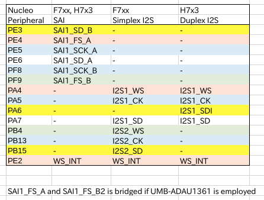

# Akashi-02
A test Jig for Murasaki-Library. Testing audio codec UMB-AD1361A and UMB-SSM2603B.

## Functionality
This board is designed to test the audio interface functionality of the STM32 series MCU. The connectors can be directly mounted on the Nucleo 144 series board. With this board, the following audio interface can be tested :
- SAI peripheral (STM32F722, F746, H743)
- Simplex I2S peripheral (STM32F722, F746)
- Duplex I2S peripheral (STM32H743)

Also, two types of CODEC control protocols can be tested :
- I2C
- SPI

Finally, Two types of the CODEC board can be tested :
- [UMB-ADAU1361A](http://dsps.shop-pro.jp/?pid=82798273)
- [UMB-SSM2603B](http://dsps.shop-pro.jp/?pid=91857895)

## Development
- [KiCad 5.1](http://kicad-pcb.org/blog/2019/03/KiCad-5.1.0-Release/)
- [Nucleo F722ZE](https://www.st.com/en/evaluation-tools/nucleo-f722ze.html)
- [Nucleo F746ZG](https://www.st.com/ja/evaluation-tools/nucleo-f746zg.html)
- [Nucleo H743ZI](https://www.st.com/ja/evaluation-tools/nucleo-h743zi.html)

The schematics [can be donwloaded](docs/Akashi-02.pdf) as PDF format. 

## Usage
The test program works with this board is published as [murasaki_test_audio](https://github.com/suikan4github/murasaki_test_audio) project. 

If you develop a software works with this board, that software has to follow the pin configuration below. Note that pin marked as "-" have to be left input or analog state. Otherwise, the board might be broken. 

## License
This PCB design is released under the [Creative Commons Attribution 4.0 International license](https://creativecommons.org/licenses/by/4.0/). You are welcome to use this design for commercial purposes. 